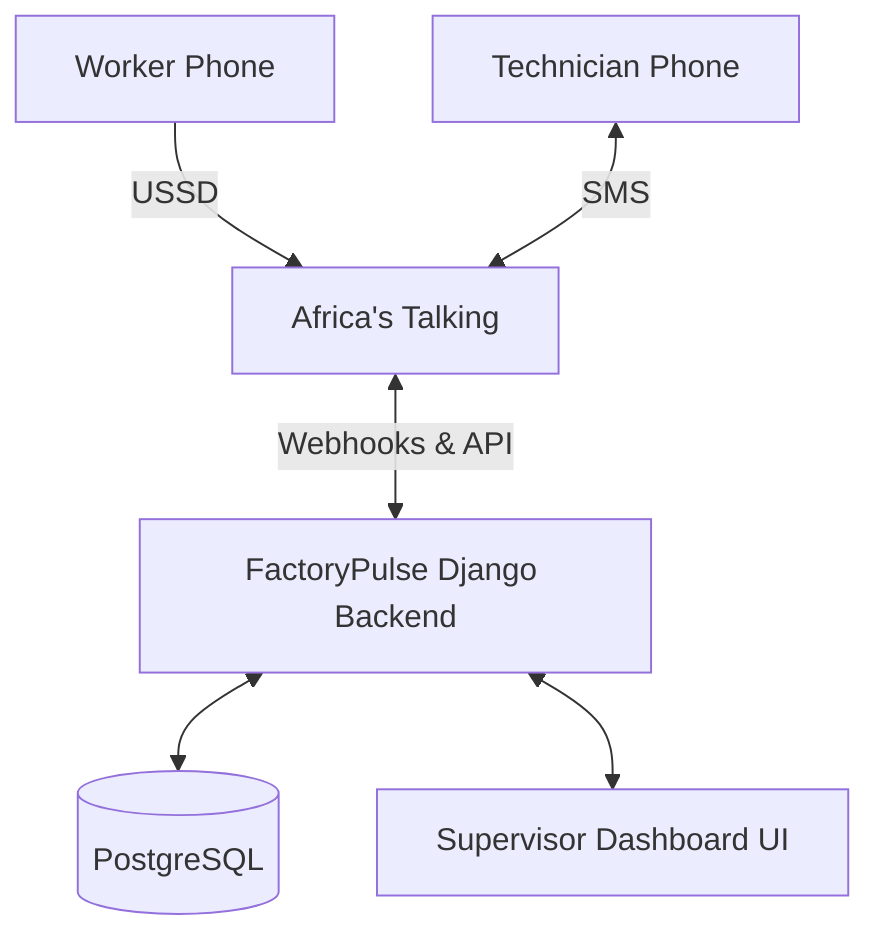

# FactoryPulse 🏭

**"Smarter Fault Reporting. Faster Maintenance."**

FactoryPulse is a lightweight manufacturing fault-reporting and maintenance coordination platform designed to bridge the gap between factory workers, supervisors, and maintenance technicians.

---

## 1. OVERVIEW

FactoryPulse solves a critical communication gap in manufacturing environments. It is a lightweight maintenance coordination platform designed around three key personas:

1. **Worker:** Reports machine faults instantly from the factory floor using USSD—without requiring a smartphone or mobile internet.
2. **Supervisor:** Manages all reported faults, monitors factory downtime, and coordinates maintenance through a secure web dashboard.
3. **Technician:** Receives maintenance assignments via SMS and interacts with the fault lifecycle directly through text messages.

By prioritizing offline-first communication channels (USSD and SMS), FactoryPulse ensures that production delays are minimized and maintenance teams are deployed faster.

---

## 2. PROBLEM STATEMENT

In many manufacturing and industrial environments:
- Machine faults need to be reported immediately to minimize downtime.
- Workers often do not have smartphones or cannot use them safely on the factory floor.
- Mobile internet availability inside factories can be a major constraint.
- Informal or paper-based fault reporting causes delays, miscommunication, or lost information.
- Supervisors lack real-time visibility into active faults and machine health.
- Technicians need clear, trackable assignments.
- Resolving machine downtime requires coordinated, visible tracking.

---

## 3. SOLUTION

FactoryPulse addresses these challenges by replacing informal reporting with a structured, communication-first workflow powered by Africa's Talking.

**The Complete Workflow:**
1. A worker reports a fault using a USSD code.
2. FactoryPulse creates a centralized fault report with a unique ID.
3. The supervisor sees the fault appear in the real-time dashboard.
4. The supervisor reviews the severity and assigns a technician.
5. The technician receives an automated SMS assignment.
6. The technician accepts the assignment via SMS.
7. The technician starts work via SMS.
8. The technician resolves the fault via SMS.
9. The supervisor tracks the entire lifecycle on the dashboard, measuring downtime and performance.

**Fault Lifecycle:**
`OPEN` → `ASSIGNED` → `ACCEPTED` → `IN_PROGRESS` → `RESOLVED`

---

## 4. KEY FEATURES

- **USSD Fault Reporting:** Smartphone-free incident reporting.
- **Dynamic Menus:** Database-driven machine, problem, and severity selection.
- **Unique Fault IDs:** Traceable incident tracking.
- **Supervisor Dashboard:** Secure, centralized operational overview.
- **Fault Management:** Lifecycle tracking and assignment capabilities.
- **Technician Assignment:** Direct dispatching to registered maintenance staff.
- **Technician Management:** Add, edit, activate, and deactivate technicians.
- **Technician Performance Metrics:** View assigned, in-progress, and successfully resolved faults natively derived from database records.
- **SMS Technician Notifications:** Automated dispatch alerts.
- **Technician SMS Workflow:** Two-way SMS commands (`ACCEPT`, `START`, `RESOLVE`).
- **Machine Management:** Operational status and health tracking.
- **Search & Filtering:** Quickly locate faults by machine, severity, status, or technician.
- **Downtime Visibility:** Aggregated downtime analytics and resolution times.
- **Factory-Scoped Authorization:** Multi-tenant access controls for supervisors.
- **Role-Based Access Control:** Strict staff and superuser boundaries.
- **PostgreSQL Persistence:** Robust relational data storage.
- **Docker Deployment:** Fully containerized production environment.

---

## 5. USER WORKFLOW

```text
  WORKER
    │
    │ (Dials USSD)
    ▼
   USSD
    │
    │ (Webhook Payload)
    ▼
FACTORYPULSE
    │
    │ (Stores Fault)
    ▼
SUPERVISOR
    │
    │ (Assigns Technician via Dashboard)
    ▼
   SMS
    │
    │ (Dispatch & Commands)
    ▼
TECHNICIAN
    │
    │ (Resolves via SMS)
    ▼
RESOLUTION
    │
    │ (Status Updated)
    ▼
DASHBOARD
```

---

## 6. AFRICA'S TALKING INTEGRATION

FactoryPulse relies heavily on Africa's Talking (AT) APIs to bridge the gap between offline factory floors and the cloud application.

**USSD Integration:**
Workers use the Africa's Talking USSD channel to report machine faults. The dynamic menus allow them to select machines, problems, and severities instantly.

**SMS Integration:**
Technicians receive fault assignment notifications through the AT SMS gateway. Furthermore, they interact with the maintenance workflow by replying with SMS commands.

**Webhook Endpoints:**
FactoryPulse exposes secure webhook endpoints to handle AT communication:
- **USSD Callback:** `POST /ussd/`
- **SMS Delivery Status:** `POST /sms/delivery/`
- **Incoming SMS Commands:** `POST /sms/incoming/`

---

## 7. ARCHITECTURE



- **Africa's Talking:** Handles all telco network routing (USSD sessions and SMS dispatch).
- **FactoryPulse Django Backend:** Manages business logic, state transitions, security, and rendering the dashboard.
- **PostgreSQL:** Persists all users, machines, fault reports, technician profiles, and history logs.
- **Supervisor Dashboard:** Secure web interface for factory management.
- **Technician SMS Workflow:** Headless two-way communication channel for maintenance staff.

---

## 8. TECHNOLOGY STACK

- **Language:** Python 3
- **Framework:** Django 5
- **Database:** PostgreSQL (Production) / SQLite (Local MVP)
- **Frontend:** HTML5, Vanilla CSS, JavaScript
- **Integrations:** Africa's Talking APIs (USSD & SMS)
- **Containerization:** Docker & Docker Compose
- **Server:** Gunicorn
- **Static Files:** WhiteNoise
- **Deployment & Hosting:** Render, Docker Hub

---

## 9. DATABASE

The platform is backed by a robust PostgreSQL relational database consisting of:

- **Users:** Django's built-in authentication model.
- **Supervisors:** Profiles linking Users to specific Factories.
- **Technicians:** Maintenance staff records linked to Users and Factories.
- **Factories:** Organizational units for multi-tenant scoping.
- **Machines:** The physical assets being monitored.
- **Fault Reports:** The core incident records tracking the problem, severity, and assigned technician.
- **Fault Status History:** An append-only log tracking every state transition (who, when, what) for accurate downtime calculation.

*Note: Technician performance metrics (like "Resolved Faults") are strictly derived through Django ORM aggregations of the `FaultReport` and `FaultStatusHistory` tables, ensuring data integrity without redundant counters.*

---

## 10. SECURITY

FactoryPulse implements essential web security measures:

- **Production Configuration:** `DEBUG` is strictly disabled in production.
- **Secrets Management:** `SECRET_KEY` and API credentials are provided via environment variables.
- **Host Validation:** `ALLOWED_HOSTS` enforced.
- **Protection Middleware:** CSRF protection, secure cookies, HSTS, X-Frame-Options, and Referrer policy configured.
- **Authorization:** Factory-scoped supervisor access (supervisors can only see their factory's data).
- **Technician Safeguards:** Technicians can only update faults explicitly assigned to them.
- **State Validation:** Strict fault lifecycle transitions enforced at the database/service layer.
- **Webhook Security:** Optional HMAC secret validation for incoming Africa's Talking SMS webhooks.
- **Data Privacy:** Phone numbers are masked in application logs.

---

## 11. TECHNICIAN MANAGEMENT

The Supervisor Dashboard includes a comprehensive Technician Management module. Supervisors can:

- **View Technicians:** See all maintenance staff assigned to their factory.
- **Add Technicians:** Provision new technicians (which automatically provisions underlying authentication safely).
- **Edit Technicians:** Update contact details.
- **Activate/Deactivate:** Suspend technicians who are on leave or no longer employed.
- **View Performance Metrics:** Track workload and efficiency natively from the database.

**Key Performance Indicators:**
- **Resolved Faults:** The primary metric showing exactly how many faults the technician successfully resolved.
- **Assigned Faults:** Total historical assignments.
- **In-Progress Faults:** Current active workload.

---

## 12. DEPLOYMENT

FactoryPulse is built for modern cloud deployment.

- **Docker Image:** `mpycraft/factorypulse:latest`
- **Hosting Platform:** Render
- **Database:** Render PostgreSQL
- **Live URL:** [https://factorypulse-m9ov.onrender.com](https://factorypulse-m9ov.onrender.com)

The deployment architecture utilizes a Dockerized Gunicorn WSGI server serving the Django application, with static assets handled seamlessly by WhiteNoise.

---

## 13. DOCKER

To build and push the Docker image yourself:

```bash
# Build the image
docker build -t mpycraft/factorypulse:latest .

# Push to Docker Hub
docker push mpycraft/factorypulse:latest
```

**Docker image:** `mpycraft/factorypulse:latest`

---

## 14. ENVIRONMENT VARIABLES

| Variable | Description |
|----------|-------------|
| `DEBUG` | Enables Django debug mode (must be False in production) |
| `SECRET_KEY` | Cryptographic key for Django sessions and security |
| `ALLOWED_HOSTS` | Comma-separated list of permitted domain names |
| `CSRF_TRUSTED_ORIGINS` | Permitted origins for CSRF validation |
| `DATABASE_URL` | PostgreSQL connection string |
| `AFRICASTALKING_USERNAME` | Africa's Talking application username |
| `AFRICASTALKING_API_KEY` | Africa's Talking secret API key |
| `AFRICASTALKING_SENDER_ID` | Optional alphanumeric sender ID for SMS |
| `AFRICASTALKING_WEBHOOK_SECRET` | Optional HMAC token for incoming SMS webhook validation |
| `PORT` | Web server port (used by Docker/Render) |

---

## 15. LOCAL DEVELOPMENT

To run the project locally for development:

1. **Create and activate a virtual environment:**
   ```bash
   python -m venv venv
   # On Windows:
   venv\Scripts\activate
   # On macOS/Linux:
   source venv/bin/activate
   ```

2. **Install dependencies:**
   ```bash
   pip install -r requirements.txt
   ```

3. **Verify configuration:**
   ```bash
   python manage.py check
   ```

4. **Run the test suite:**
   ```bash
   python manage.py test
   ```

5. **Start the development server:**
   ```bash
   python manage.py runserver
   ```

---

## 16. TESTING

FactoryPulse maintains a robust testing culture. The project currently has **159 automated tests passing**.

The test suite thoroughly covers:
- USSD dynamic menu generation and state machines.
- SMS dispatch and incoming command parsing.
- Dashboard authorization and factory-scoping rules.
- Technician performance metric calculations.
- Strict fault state transitions.

---

## 17. LIVE DEMO

- **Live Application:** [https://factorypulse-m9ov.onrender.com](https://factorypulse-m9ov.onrender.com)
- **GitHub Repository:** [https://github.com/Mansur-WP/factorypulse.git](https://github.com/Mansur-WP/factorypulse.git)
- **Docker Image:** `mpycraft/factorypulse:latest`

Demo video: To be added before final submission.

---

## 18. DEMO CREDENTIALS

Demo credentials are provided through the official hackathon submission form and should not be committed to the repository.

---

## 19. HACKATHON ALIGNMENT

**Innovation:**
FactoryPulse introduces a practical, communication-first maintenance workflow that prioritizes the realities of harsh factory environments over complex smartphone apps.

**Manufacturing Relevance:**
The entire application is laser-focused on the manufacturing domain: tracking machine faults, measuring downtime, coordinating maintenance, and empowering technicians.

**Africa's Talking Integration:**
USSD and SMS are not just add-ons; they are the central nervous system of the worker and technician workflows. 

**Technical Implementation:**
A robust, secure implementation utilizing Django, PostgreSQL, and Docker, complete with webhook security, role-based access control, and strict state machine validations.

**Scalability:**
Built on a relational database with multi-tenant capabilities (Factories) and containerized via Docker for horizontal scaling.

**Usability:**
Zero-training USSD interface for workers, a clean visual dashboard for supervisors, and simple text commands for technicians.

**Real-World Impact:**
Reduces communication gaps, accelerates fault reporting, clarifies maintenance assignments, and provides actionable visibility into production downtime.

---

## 20. SCALABILITY

**FUTURE Improvements for Scale:**
- **Multiple Factories:** Expanding the existing multi-tenant architecture for enterprise group management.
- **Queue/Background Processing:** Implementing Celery/Redis for asynchronous SMS dispatch at massive scale.
- **Worker Registration/Identity:** Pinning USSD reports to verified worker profiles.
- **Advanced Analytics:** Predictive insights based on historical machine failure rates.
- **IoT Integration:** Automatically triggering fault reports from machine sensors.

---

## 21. LIMITATIONS

As an MVP, FactoryPulse has some intentional limitations:
- Worker USSD reporting is not currently authenticated to a registered worker identity (anyone with the USSD code can report).
- Technician SMS authentication relies on phone-number matching rather than advanced multi-factor methods.
- Advanced predictive maintenance or direct IoT integrations are outside the scope of this communication-focused MVP.

---

## 22. FUTURE IMPROVEMENTS

- Granular notification delivery tracking and read receipts.
- Inventory integration to track spare parts used during resolution.
- Scheduled preventive maintenance USSD workflows.

---

## 23. PROJECT STATUS

FactoryPulse MVP is implemented, Dockerized, and deployed.

- **Live:** [https://factorypulse-m9ov.onrender.com](https://factorypulse-m9ov.onrender.com)
- **Docker:** `mpycraft/factorypulse:latest`
- **GitHub:** [https://github.com/Mansur-WP/factorypulse.git](https://github.com/Mansur-WP/factorypulse.git)

---

## 24. LICENSE

This project was developed as a manufacturing technology hackathon project.

---

## 25. HACKATHON SUBMISSION CHECKLIST

- [x] Team information
- [x] Short description
- [x] Full solution description
- [x] Problem statement
- [x] Key features
- [x] User workflow
- [x] Africa's Talking products
- [x] Africa's Talking integration explanation
- [x] Technologies used
- [x] Git repository
- [x] Live application
- [ ] Demo/walkthrough video
- [ ] Demo credentials supplied through submission form
- [x] Docker image
- [x] Environment variable documentation
- [x] Solution documentation prepared
- [x] Team declaration
